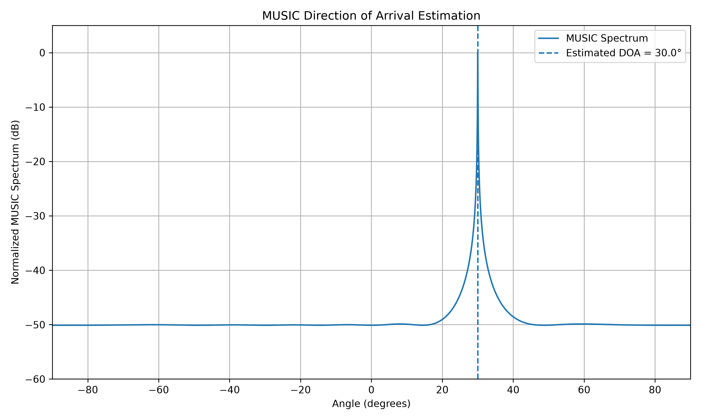
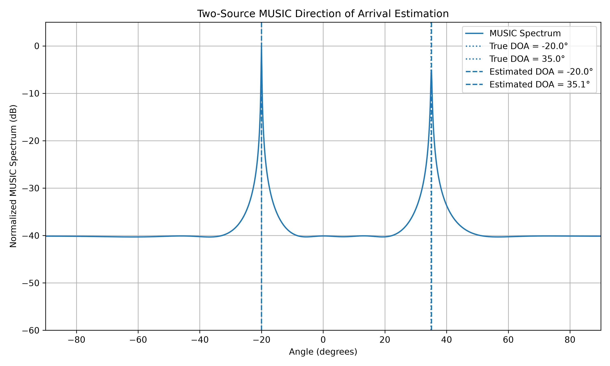
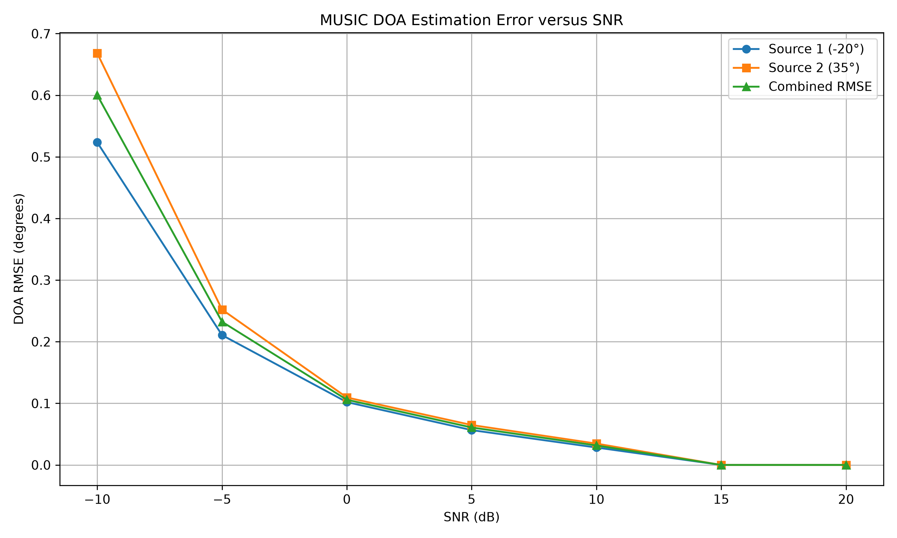
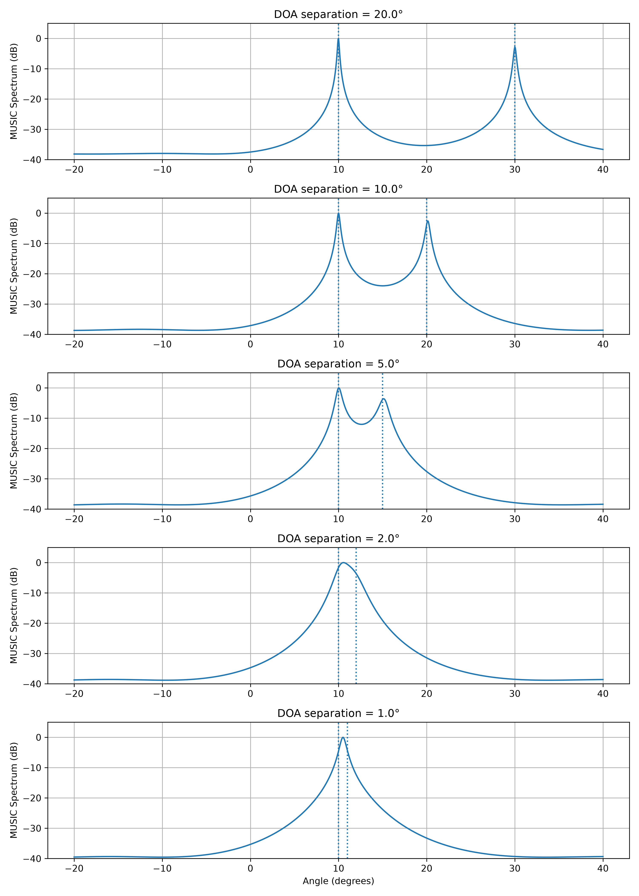

# Direction of Arrival Estimation Using MUSIC

## About This Project

I am building this project to understand how Direction of Arrival (DOA) estimation works using antenna arrays and signal processing.

The main algorithm used in this project is MUSIC (Multiple Signal Classification). I started from the basic signal model and built the project step by step instead of using a ready-made DOA implementation.

The current version uses a Uniform Linear Array (ULA) and estimates the direction of multiple incoming signals from the spatial information contained in the signals received by the antenna elements.

I am mainly using Python for the simulation and signal processing.

---

# 1. What is Direction of Arrival?

Direction of Arrival means finding the direction from which a signal is arriving at an antenna array.

For example, imagine a signal arriving at an antenna array from an angle theta:

```text

                     Incoming signal

                           \\

                            \\

                             \\  theta

                              \\

                               \\

       o----o----o----o----o----o----o----o

      A0   A1   A2   A3   A4   A5   A6   A7

                  Antenna Array

```

The objective is to look at the signals received by all the antennas and estimate the angle without directly giving the algorithm the answer.

DOA estimation is useful in areas such as radar, wireless communications, radio direction finding, sonar, remote sensing and sensor arrays.

In this project I am starting with a simple 1D case, where the antenna elements are arranged in a straight line.

---

# 2. What is a ULA?

ULA means Uniform Linear Array.

It is a set of antenna elements placed in a straight line with equal spacing.

For this project I am using 8 antenna elements:

```text

A0     A1     A2     A3     A4     A5     A6     A7

o------o------o------o------o------o------o------o

        Uniform Linear Array (ULA)

```

The antenna spacing is:

```math

d = \frac{\lambda}{2}

```

where:

- `d` = distance between two adjacent antenna elements

- `lambda` = wavelength of the signal

I use half-wavelength spacing in the simulation because it is a common array configuration and helps avoid spatial aliasing over the normal scan range.

---

# 3. Why can an antenna array find the direction?

When a plane wave reaches an antenna array at an angle, it does not reach every antenna with exactly the same phase.

There is a phase difference between adjacent elements.

For a ULA, the phase difference can be written as:

```math

\Delta\phi = -2\pi\frac{d}{\lambda}\sin(\theta)

```

For example, in one of my experiments:

```math

\theta = 30^\circ

```

and:

```math

d = \frac{\lambda}{2}

```

Therefore:

```math

\Delta\phi = -2\pi\left(\frac{1}{2}\right)\sin(30^\circ) = -90^\circ

```

So the antennas receive the same underlying signal with a different phase progression.

This phase difference contains information about the direction of the incoming signal. This is the basic idea behind the DOA estimation used in this project.

---

# 4. Steering Vector

The steering vector describes the phase relationship across all the antenna elements for a particular direction.

For a ULA with `M` elements:

$$
\mathbf{a}(\theta)=
\begin{bmatrix}
1 \\
e^{-j2\pi\frac{d}{\lambda}\sin(\theta)} \\
e^{-j2\pi\frac{2d}{\lambda}\sin(\theta)} \\
\vdots \\
e^{-j2\pi\frac{(M-1)d}{\lambda}\sin(\theta)}
\end{bmatrix}
$$

    
In the Python code, I generate this vector in:

```text

src/array_model.py

```

The first experiment was only about understanding this steering vector before moving to the complete MUSIC algorithm.

---

# 5. Signal Model

The first step was to generate a complex baseband source signal.

For a single source, the received array data can be represented as:

```math

X = a(\theta)s(t)

```

For multiple sources, the model becomes:

```math

X = AS

```

where:

- `X` = received array data

- `A` = steering matrix

- `S` = source signals

When noise is added, the model becomes:

```math

X = AS + N

```

where `N` represents noise.

For the simulation I use complex AWGN (Additive White Gaussian Noise).

The signal model and noise generation are implemented in:

```text

src/signal_generation.py

```

---

# 6. Why is Noise Important?

An ideal signal is not enough to test a radar or signal-processing algorithm.

Real receivers contain noise, so I added AWGN to the received array data.

I tested different SNR values such as:

```text

20 dB

10 dB

 0 dB

-10 dB

```

At high SNR, the signal structure is easier to observe.

At low SNR, the noise becomes stronger and the phase information becomes harder to see from an individual sample.

This is important because MUSIC is not supposed to work only with a perfect signal. It has to use the spatial information present in many noisy measurements.

---

# 7. Covariance Matrix

MUSIC does not estimate the direction from only one sample.

The antenna array collects many snapshots of the received signal.

In the current experiment I use:

```text

8 antenna elements

1000 snapshots

```

So the received data matrix has the shape:

```math

X \in \mathbb{C}^{8\times1000}

```

From this data I calculate the spatial covariance matrix:

```math

R_{xx} = \frac{1}{N}XX^H

```

where:

- `N` = number of snapshots

- `X^H` = conjugate transpose of `X`

- `Rxx` = spatial covariance matrix

The covariance matrix has the shape:

```math

R_{xx} \in \mathbb{C}^{8\times8}

```

The covariance matrix contains information about the spatial relationship between the antenna elements.

I calculate this in:

```text

src/covariance.py

```

---

# 8. Eigenvalue Decomposition

The next step is to perform eigenvalue decomposition on the covariance matrix.

I use `numpy.linalg.eigh()` because the covariance matrix is Hermitian.

The decomposition is:

```math

R_{xx} = E\Lambda E^H

```

where:

- `E` contains the eigenvectors

- `Lambda` contains the eigenvalues

For one signal source and 8 antenna elements, I expect:

```text

1 signal dimension

7 noise dimensions

```

For two independent signal sources:

```text

2 signal dimensions

6 noise dimensions

```

For example, in the two-source experiment I obtained eigenvalues approximately like:

```text

0.1819

0.1929

0.2010

0.2078

0.2143

0.2327

7.1321

9.1621

```

The two larger eigenvalues are associated with the two signal dimensions, while the remaining eigenvalues form the noise part.

The eigenvalue and eigenvector calculation is implemented in:

```text

src/eigendecomposition.py

```

---

# 9. Signal Subspace and Noise Subspace

This is the main idea behind MUSIC.

The eigenvectors can be separated into signal and noise subspaces.

For two sources and eight antennas:

```text

8 eigenvectors

     |

     +---- 2 signal eigenvectors

     |

     +---- 6 noise eigenvectors

```

The MUSIC algorithm uses the noise subspace.

At the correct direction, the steering vector is approximately orthogonal to the noise subspace.

This can be written as:

```math

a^H(\theta)E_n \approx 0

```

where:

- `a(theta)` = steering vector

- `En` = noise-subspace eigenvectors

This property is what allows MUSIC to estimate the DOA.

---

# 10. MUSIC Pseudospectrum

The MUSIC pseudospectrum used in this project is:

```math

P_{MUSIC}(\theta)=\frac{1}{\left|a^H(\theta)E_nE_n^Ha(\theta)\right|}

```

The algorithm scans a range of angles.

In the current experiment I scan:

```text

-90 degrees to +90 degrees

```

For every angle, the steering vector is calculated and compared with the noise subspace.

At the true signal direction, the denominator becomes very small. This creates a large peak in the MUSIC spectrum.

The basic process is:

```text

Scan angle
    |
    v
Generate steering vector
    |
    v
Compare with noise subspace
    |
    v
Calculate MUSIC value
    |
    v
Move to next angle
    |
    v
Find peaks

```

The implementation is in:

```text

src/music.py

```

---

# 11. Single-Source Experiment

I first tested MUSIC with one signal source.

The source was placed at:

```math

\theta = 30^\circ

```

The main parameters were:

```text

Number of antennas : 8

Element spacing    : 0.5 lambda

Snapshots          : 1000

SNR                : 10 dB

True DOA           : 30 degrees

```

The estimated DOA was:

```text

30.0 degrees

```

The resulting MUSIC spectrum shows a clear peak around 30 degrees.



---

# 12. Two-Source Experiment

After testing one source, I extended the simulation to two independent sources.

The two true directions were:

```math

\theta_1 = -20^\circ

```

and:

```math

\theta_2 = 35^\circ

```

The parameters were:

```text

Number of antennas : 8

Element spacing    : 0.5 lambda

Snapshots          : 1000

SNR                : 10 dB

Number of sources  : 2

True DOAs           : -20 degrees, 35 degrees

```

The MUSIC algorithm estimated:

```text

Source 1:

True DOA      = -20.0 degrees

Estimated DOA = -20.0 degrees

Error         = 0.0 degrees

Source 2:

True DOA      = 35.0 degrees

Estimated DOA = 35.1 degrees

Error         = 0.1 degrees

```

This shows two separate peaks in the MUSIC spectrum.



---

# 13. DOA Estimation Error versus SNR

After testing MUSIC with one source and two sources, I wanted to check how the accuracy changes when the signal becomes weaker compared with the noise.

For this experiment, I kept the same two signal directions:

$$
\theta_1=-20^\circ
$$

$$
\theta_2=35^\circ
$$

I tested the algorithm at different SNR values.

The SNR values used were:

```text
-10 dB
 -5 dB
  0 dB
  5 dB
 10 dB
 15 dB
 20 dB
```

For each SNR value, I ran the simulation for 50 different noise realizations.

The main parameters were:

```text
Number of antennas : 8
Element spacing    : 0.5 λ
Number of sources  : 2
True DOAs           : -20° and 35°
Snapshots           : 1000
Trials per SNR      : 50
```

For every trial, I calculated the DOA estimation error and then calculated the Root Mean Square Error (RMSE).

The RMSE is calculated as:

$$
RMSE=
\sqrt{
\frac{1}{N}
\sum_{i=1}^{N}
\left(
\hat{\theta}_i-\theta_i
\right)^2
}
$$

where:

- $\hat{\theta}_i$ is the estimated DOA
- $\theta_i$ is the true DOA
- $N$ is the number of trials

## Results

The results obtained from the simulation are:

| SNR (dB) | Source 1 RMSE (°) | Source 2 RMSE (°) | Combined RMSE (°) |
|----------:|------------------:|------------------:|-------------------:|
| -10 | 0.524 | 0.668 | 0.600 |
| -5  | 0.211 | 0.252 | 0.232 |
| 0   | 0.102 | 0.110 | 0.106 |
| 5   | 0.057 | 0.065 | 0.061 |
| 10  | 0.028 | 0.035 | 0.032 |
| 15  | 0.000 | 0.000 | 0.000 |
| 20  | 0.000 | 0.000 | 0.000 |

The results show that the DOA estimation error decreases as the SNR increases.

At `-10 dB`, the noise has a much stronger effect on the received signals, and the RMSE is higher.

At `10 dB`, the combined RMSE is `0.032°`.

At `15 dB` and `20 dB`, the estimated DOAs landed exactly on the true angles for the angle grid used in the simulation.

The angle grid used in the MUSIC search was:

```text
-90° to +90°
```

with a step size of:

$$
0.1^\circ
$$

Therefore, an RMSE of `0.000°` means that the detected peak landed exactly on the correct point of this `0.1°` search grid in the tested trials. It does not mean that the continuous-angle estimation error is mathematically zero.

## DOA Error versus SNR

The following figure shows the change in DOA RMSE as the SNR is increased.



The overall trend is clear: increasing the SNR makes the spatial information easier to distinguish from noise, resulting in lower DOA estimation error for this simulation.

The complete experiment is implemented in:

```text
experiments/doa_vs_snr.py
```
---

# 14. MUSIC Angular Resolution Study

After testing the effect of SNR on the DOA estimation error, I wanted to check how close two signal sources can be before the MUSIC algorithm has difficulty distinguishing them.

For this experiment, I kept the first source fixed at:

$$

\theta_1 = 10^\circ

$$

and moved the second source closer to it.

The angular separations tested were:

```text

20°

10°

5°

2°

1°

```

The main parameters used in this experiment were:

```text

Number of antennas : 8

Element spacing    : 0.5 λ

Snapshots          : 1000

SNR                : 10 dB

First DOA          : 10°

Number of sources  : 2

```

For each case, I generated two independent signals and passed them through the same ULA signal model used in the previous experiments.

The MUSIC pseudospectrum was then calculated and the two strongest distinct peaks were used for the DOA estimation.

## Resolution Criterion

For this experiment, I used a maximum allowed DOA error of:

$$

0.5^\circ

$$

A case is considered **resolved** when both detected DOAs are within `0.5°` of their corresponding true DOAs.

This is the criterion used for this particular simulation. It should not be considered a universal resolution limit for MUSIC because DOA resolution also depends on factors such as the number of antenna elements, SNR, number of snapshots, array spacing and source characteristics.

## Results

The results obtained from the simulation are:

| Angular Separation | True DOAs | Estimated DOAs | Maximum DOA Error | Resolution |

|---:|---|---|---:|---|

| 20° | 10°, 30° | 10°, 30° | 0.00° | Resolved |

| 10° | 10°, 20° | 10°, 20.15° | 0.15° | Resolved |

| 5° | 10°, 15° | 10.05°, 15.10° | 0.10° | Resolved |

| 2° | 10°, 12° | -16°, 10.55° | 26.00° | Not resolved |

| 1° | 10°, 11° | -15.95°, 10.50° | 25.95° | Not resolved |

The results show that, under the conditions used in this experiment, the two sources were correctly resolved for angular separations of `20°`, `10°` and `5°`.

For the `2°` and `1°` cases, the two sources were not correctly resolved.

For example, when the true directions were:

$$

\theta_1 = 10^\circ

$$

and

$$

\theta_2 = 12^\circ

$$

the estimated directions were approximately:

```text

-16.0°

10.55°

```

The `-16°` peak does not correspond to an actual source in the simulation. It is a spurious peak selected by the peak-detection method when the two sources could not be correctly separated.

This is an important limitation to observe because the algorithm should not be evaluated only using successful cases.

## MUSIC Spectrum for Different Angular Separations

The figure below shows how the MUSIC pseudospectrum changes as the angular separation between the two sources decreases.



For larger angular separations, two distinct peaks can be clearly observed.

As the sources become closer, the peaks become less separated. At `2°` and `1°` separation, the two sources are no longer correctly distinguished under the conditions used in this simulation.

The experiment is implemented in:

```text

experiments/angular_resolution.py

```

# 15. Complete Processing Flow

The complete processing chain in the current version is:

```text

Source Signals
      |
      v
ULA Steering Vectors
      |
      v
Received Array Data
      |
      v
Add AWGN
      |
      v
Spatial Covariance Matrix
      |
      v
Eigenvalue Decomposition
      |
      v
Signal / Noise Subspaces
      |
      v
MUSIC Pseudospectrum
      |
      v
Peak Detection
      |
      v
Estimated DOAs

```

In mathematical form:

```math

S \rightarrow A \rightarrow X = AS + N \rightarrow R_{xx} \rightarrow E,\Lambda \rightarrow E_n \rightarrow P_{MUSIC}(\theta) \rightarrow \hat{\theta}

```

---

# 16. Project Structure

The current project is organized as:

```text
doa-estimation-music/
│
├── .gitignore
├── README.md
├── main.py
│
├── experiments/
│   └── doa_vs_snr.py
│
├── results/
│   ├── music_spectrum_one_source.png
│   ├── music_spectrum_two_sources.png
│   └── doa_error_vs_snr.png
│
└── src/
    ├── array_model.py
    ├── signal_generation.py
    ├── covariance.py
    ├── eigendecomposition.py
    └── music.py
```

Each file has a separate purpose.

### `main.py`

Runs the complete experiment.

### `array_model.py`

Generates the ULA steering vector.

### `signal_generation.py`

Generates source signals and received array data, including AWGN.

### `covariance.py`

Calculates the spatial covariance matrix.

### `eigendecomposition.py`

Calculates the eigenvalues and eigenvectors.

### `music.py`

Calculates the MUSIC pseudospectrum and estimates the DOAs.

### `results/`

Stores the generated experiment results.

---

# 17. Technologies Used

- Python 3

- NumPy

- Matplotlib

- Git

- GitHub

---

# 18. Running the Project

Clone the repository:

```bash

git clone https://github.com/RamaRajuY/doa-estimation-music.git

```

Go into the project directory:

```bash

cd doa-estimation-music

```

Install the required Python packages:

```bash

python -m pip install numpy matplotlib

```

Run the experiment:

```bash

python main.py

```

The program generates the MUSIC spectrum and saves the result in the `results` folder.

---

# 19. What I Want to Add Next

This project is still a work in progress.

The next experiments I want to add are:

1. DOA estimation performance versus SNR

2. DOA estimation error analysis

3. Closely spaced sources

4. Effect of the number of antenna elements

5. Comparison with conventional beamforming

6. ESPRIT DOA estimation

7. Different array geometries

8. 2D DOA estimation using a planar/rhombus array

The longer-term goal is to move from this basic 1D ULA implementation toward more realistic radar and RF signal-processing simulations.

---

# 20. Why I Built This Project

I am interested in RF systems, antenna arrays, radar signal processing and sensing.

I wanted to understand DOA estimation from the basics instead of only using a ready-made implementation.

Because of that, I built this project step by step:

```text

ULA
 |
 v
Steering Vector
 |
 v
Signal Generation
 |
 v
Noise
 |
 v
Covariance Matrix
 |
 v
Eigenvalue Decomposition
 |
 v
MUSIC
 |
 v
Single Source
 |
 v
Multiple Sources

```

I will keep extending the project as I learn more about array processing and radar signal processing.
