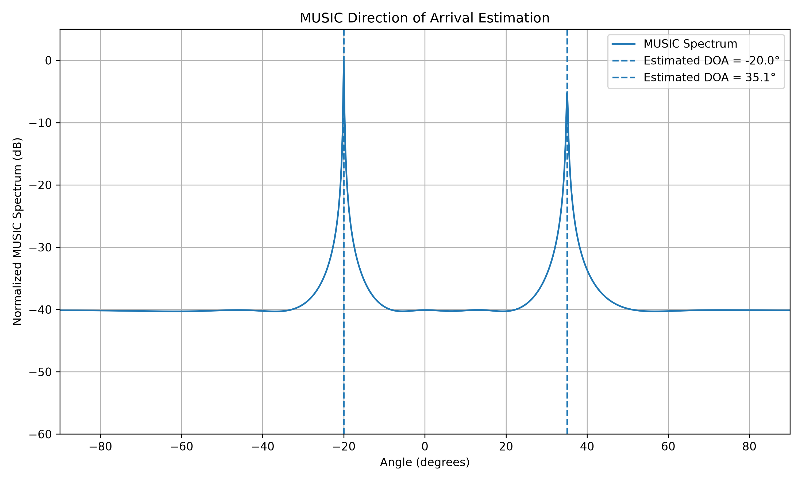

# Direction of Arrival Estimation Using MUSIC

## About This Project

I am building this project to understand how Direction of Arrival (DOA) estimation works using antenna arrays and signal processing.

I started this project from the basic signal model and built it step by step. The main algorithm used in this project is **MUSIC (Multiple Signal Classification)**.

The current version uses a **Uniform Linear Array (ULA)** and estimates the direction of multiple incoming signals from the phase information received by the antenna elements.

I am mainly using Python for the simulation and signal processing.

---

# 1. What is Direction of Arrival?

Direction of Arrival means finding the direction from which a signal is arriving at an antenna array.

For example, imagine a signal arriving from this direction:

```text
                     Incoming signal
                           \\
                            \\
                             \\  theta
                              \\
                               \\
       o----o----o----o----o----o----o----o
      A0   A1   A2   A3   A4   A5   A6   A7

                  Antenna Array
```

The objective is to look at the signals received by all the antennas and estimate the angle `theta`.

This is useful in many areas such as:

- Radar
- Wireless communications
- Radio direction finding
- Sonar
- Remote sensing
- Sensor arrays

In this project I am starting with a simple 1D case, where the antenna elements are arranged in a straight line.

---

# 2. What is a ULA?

ULA means **Uniform Linear Array**.

It is simply a set of antenna elements placed in a straight line with equal spacing.

For this project I am using 8 antenna elements:

```text
o----o----o----o----o----o----o----o
A0   A1   A2   A3   A4   A5   A6   A7
```

The antenna spacing is:

\[
d = \frac{\lambda}{2}
\]

where:

- `d` = distance between two adjacent antenna elements
- `lambda` = wavelength of the signal

Using half-wavelength spacing is a common choice for array simulations because it helps avoid spatial aliasing over the usual scan range.

---

# 3. Why can an antenna array find the direction?

When a plane wave reaches an antenna array at an angle, it does not reach every antenna with exactly the same phase.

There is a phase difference between adjacent elements.

For a ULA, the phase difference is:

\[
\Delta\phi = -2\pi\frac{d}{\lambda}\sin(\theta)
\]

For example, in one of my experiments:

\[
\theta = 30^\circ
\]

and

\[
d=\frac{\lambda}{2}
\]

which gives:

\[
\Delta\phi=-90^\circ
\]

So the antennas see the same signal with a different phase progression.

This phase difference contains information about the direction of the incoming signal.

This is the basic idea behind the DOA estimation used in this project.

---

# 4. Steering Vector

The steering vector describes the phase relationship across all the antenna elements for a particular direction.

For a ULA with `M` elements:

\[
\mathbf{a}(\theta)=
\begin{bmatrix}
1\\
e^{-j2\pi\frac{d}{\lambda}\sin\theta}\\
e^{-j2\pi\frac{2d}{\lambda}\sin\theta}\\
\vdots\\
e^{-j2\pi\frac{(M-1)d}{\lambda}\sin\theta}
\end{bmatrix}
\]

In the Python code, I generate this vector in:

```text
src/array_model.py
```

The first experiment was only about understanding this steering vector before moving to the complete MUSIC algorithm.

---

# 5. Signal Model

The first step was to generate a complex baseband source signal.

The received signal at the antenna array can be represented as:

\[
X = AS
\]

where:

- `X` = received array data
- `A` = steering matrix
- `S` = source signals

When noise is added, the model becomes:

\[
\boxed{X = AS + N}
\]

where `N` represents noise.

For the simulation I use complex AWGN (Additive White Gaussian Noise).

The noise model is implemented in:

```text
src/signal_generation.py
```

---

# 6. Why is Noise Important?

An ideal signal is not very useful for testing a radar or signal-processing algorithm.

Real receivers contain noise, so I added AWGN to the received array data.

I tested different SNR values such as:

```text
20 dB
10 dB
 0 dB
-10 dB
```

At high SNR, the signal structure is easier to see.

At low SNR, the noise becomes stronger and the phase information becomes harder to observe from individual samples.

This is important because MUSIC is not supposed to work only with a perfect signal. It has to extract the spatial information from noisy measurements.

---

# 7. Covariance Matrix

MUSIC does not directly work from one sample.

The array collects many snapshots of the received signal.

In this project I currently use:

```text
8 antenna elements
1000 snapshots
```

So the received data matrix has the shape:

\[
X \in \mathbb{C}^{8\times1000}
\]

From this data I calculate the spatial covariance matrix:

\[
\boxed{
R_{xx}=\frac{1}{N}XX^H
}
\]

where:

- `N` = number of snapshots
- `X^H` = conjugate transpose of `X`

The covariance matrix has the shape:

\[
R_{xx}\in\mathbb{C}^{8\times8}
\]

I calculate this in:

```text
src/covariance.py
```

The covariance matrix contains information about the spatial relationship between the antenna elements.

---

# 8. Eigenvalue Decomposition

The next step is to perform eigenvalue decomposition on the covariance matrix.

I use:

```python
np.linalg.eigh()
```

because the covariance matrix is Hermitian.

The decomposition is:

\[
R_{xx}=E\Lambda E^H
\]

where:

- `E` contains the eigenvectors
- `Lambda` contains the eigenvalues

For one signal source and 8 antenna elements, we expect:

```text
1 signal dimension
7 noise dimensions
```

For two independent signal sources:

```text
2 signal dimensions
6 noise dimensions
```

For example, in the two-source experiment I obtained eigenvalues approximately like:

```text
0.1819
0.1929
0.2010
0.2078
0.2143
0.2327
7.1321
9.1621
```

The two larger eigenvalues are associated with the two signal dimensions, while the remaining eigenvalues form the noise part.

The eigenvalue and eigenvector calculation is implemented in:

```text
src/eigendecomposition.py
```

---

# 9. Signal Subspace and Noise Subspace

This is the main idea behind MUSIC.

The eigenvectors can be separated into:

```text
Eigenvectors
     |
     +-------------------+
     |                   |
     v                   v
Signal subspace      Noise subspace
```

For two sources and eight antennas:

```text
8 eigenvectors
     |
     +---- 2 signal eigenvectors
     |
     +---- 6 noise eigenvectors
```

The MUSIC algorithm uses the **noise subspace**.

At the correct direction, the steering vector is nearly orthogonal to the noise subspace.

In mathematical form:

\[
a^H(\theta)E_n \approx 0
\]

where:

- `a(theta)` = steering vector
- `E_n` = noise-subspace eigenvectors

This property is what allows MUSIC to estimate the DOA.

---

# 10. MUSIC Pseudospectrum

The MUSIC pseudospectrum used in this project is:

\[
\boxed{
P_{MUSIC}(\theta)
=
\frac{1}
{\left|a^H(\theta)E_nE_n^Ha(\theta)\right|}
}
\]

The algorithm scans a range of angles.

In my current experiment:

```text
-90 degrees to +90 degrees
```

For every angle, the steering vector is calculated and compared with the noise subspace.

At the true signal direction, the denominator becomes very small.

This creates a large peak in the MUSIC spectrum.

So the basic process is:

```text
Scan angle
    |
Generate steering vector
    |
Compare with noise subspace
    |
Calculate MUSIC value
    |
Move to next angle
    |
Find peaks
```

The implementation is in:

```text
src/music.py
```

---

# 11. Single-Source Experiment

I first tested MUSIC with one signal source.

The source was placed at:

\[
\theta=30^\circ
\]

The main parameters were:

```text
Number of antennas : 8
Element spacing    : 0.5 lambda
Snapshots          : 1000
SNR                : 10 dB
True DOA           : 30 degrees
```

The estimated DOA was:

```text
30.0 degrees
```

The resulting MUSIC spectrum shows a clear peak around 30 degrees.



---

# 12. Two-Source Experiment

After testing one source, I extended the simulation to two independent sources.

The two true directions were:

\[
\theta_1=-20^\circ
\]

\[
\theta_2=35^\circ
\]

The parameters were:

```text
Number of antennas : 8
Element spacing    : 0.5 lambda
Snapshots          : 1000
SNR                : 10 dB
Number of sources  : 2
True DOAs           : -20 degrees, 35 degrees
```

The MUSIC algorithm estimated:

```text
Source 1:
True DOA      = -20.0 degrees
Estimated DOA = -20.0 degrees
Error         = 0.0 degrees

Source 2:
True DOA      = 35.0 degrees
Estimated DOA = 35.1 degrees
Error         = 0.1 degrees
```

This shows two separate peaks in the MUSIC spectrum.


---

# 13. Complete Processing Flow

The complete processing chain in the current version is:

```text
Source Signals
      |
ULA Steering Vectors
      |
Received Array Data
      |
Add AWGN
      |
Spatial Covariance Matrix
      |
Eigenvalue Decomposition
      |
Signal / Noise Subspaces
      |
MUSIC Pseudospectrum
      |
Peak Detection
      |
Estimated DOAs
```

In mathematical form:

\[
S
\rightarrow
A
\rightarrow
X=AS+N
\rightarrow
R_{xx}
\rightarrow
E,\Lambda
\rightarrow
E_n
\rightarrow
P_{MUSIC}(\theta)
\rightarrow
\hat{\theta}
\]

---

# 14. Project Structure

The current project is organized as:

```text
doa-estimation-music/
|
|-- .gitignore
|-- README.md
|-- main.py
|
|-- results/
|   |-- music_spectrum.png
|   `-- music_spectrum_two_sources.png
|
`-- src/
    |-- array_model.py
    |-- signal_generation.py
    |-- covariance.py
    |-- eigendecomposition.py
    `-- music.py
```

Each file has a separate purpose.

### `main.py`

Runs the complete experiment.

### `array_model.py`

Generates the ULA steering vector.

### `signal_generation.py`

Generates the source signals and received array data, including AWGN.

### `covariance.py`

Calculates the spatial covariance matrix.

### `eigendecomposition.py`

Calculates the eigenvalues and eigenvectors.

### `music.py`

Calculates the MUSIC spectrum and estimates the DOAs.

### `results/`

Stores the generated experiment results.

---

# 15. Technologies Used

- Python 3
- NumPy
- Matplotlib
- Git
- GitHub

---

# 16. Running the Project

Clone the repository:

```bash
git clone https://github.com/RamaRajuY/doa-estimation-music.git
```

Go into the project directory:

```bash
cd doa-estimation-music
```

Install the required Python packages:

```bash
python -m pip install numpy matplotlib
```

Run the experiment:

```bash
python main.py
```

The program generates the MUSIC spectrum and saves the result in:

```text
results/
```

---

# 17. What I Want to Add Next

This project is still a work in progress.

The next experiments I want to add are:

1. DOA estimation performance versus SNR
2. DOA estimation error analysis
3. Closely spaced sources
4. Effect of the number of antenna elements
5. Comparison with conventional beamforming
6. ESPRIT DOA estimation
7. Different array geometries
8. 2D DOA estimation using a planar/rhombus array

The long-term goal is to move from this basic 1D ULA implementation toward more realistic radar and RF signal-processing simulations.

---

# 18. Why I Built This Project

I am interested in RF systems, antenna arrays, radar signal processing and sensing.

I wanted to understand DOA estimation from the basics instead of only using a ready-made implementation.

Because of that, I built this project step by step:

```text
ULA
 |
Steering Vector
 |
Signal Generation
 |
Noise
 |
Covariance Matrix
 |
Eigenvalue Decomposition
 |
MUSIC
 |
Single Source
 |
Multiple Sources
```

I will keep extending the project as I learn more about array processing and radar signal processing.